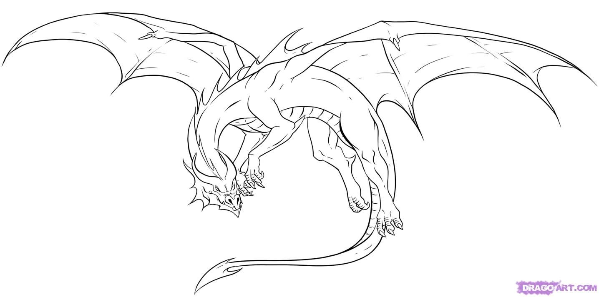
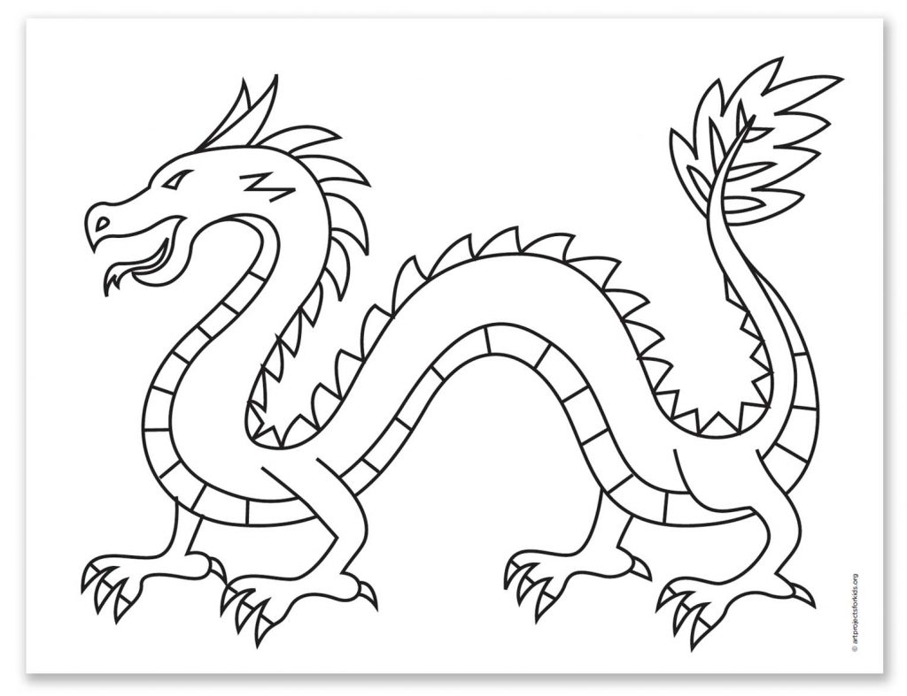
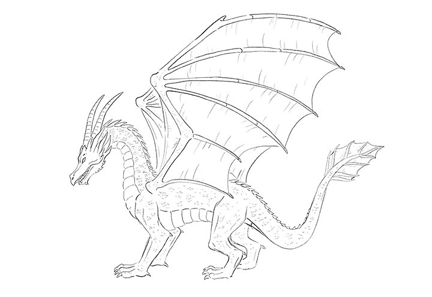

Importing the nexus data
```{r}
library(ape) #loading ape into R
DragonNexus <- read.nexus.data("input/DragonMatrix.nex") #reading the nexus fille
head(DragonNexus) #checking the data
```
Weights
```{r}
WeightsDat <- read.csv("input/Weights.csv") #reading the csv file for weights 
```
Creating a single vector of weights
```{r}
Weights <- paste0(WeightsDat$Weight, collapse = "") #isolating weights from the data frame 
Weights <- strsplit(Weights, split = "")[[1]] #splitting values into individual characters 
```
Convert each letter to a value
```{r}
WeightsNum<-rep(NA,length(Weights)) 
for(i in 1:length(WeightsNum)){ #converting each letter to a value using a for loop
  if(Weights[i] %in% LETTERS){
    WeightsNum[i]<-which(LETTERS==Weights[i])+9
  } else {
    WeightsNum[i]<-Weights[i]
  }
}
WeightsNum<-as.numeric(WeightsNum) #changing weightsnum to a numeric character
```
Multiply the weight value by the trait vector for each dragon 
```{r}
WtDragonNexus<-DragonNexus # Make a new weighted data frame object
for (i in 1:length(DragonNexus)){ 
  RepWeight<-DragonNexus[[i]]==1
  WtDragonNexus[[i]][RepWeight]<-WeightsNum[RepWeight]
  RepWeight<-NA
}
```
Re-calcualting our distance matrix
```{r}
WtDragonNexusDF<-data.frame(matrix(unlist(WtDragonNexus),ncol=78,byrow=T)) #creating a dataframe of the weighted characteristics 
row.names(WtDragonNexusDF)<-names(WtDragonNexus) #adding row names 
WtDragonDist<-dist(WtDragonNexusDF,method='euclidean') #adding the distance to the dataframe 
WtDragonDistMat <- as.matrix(WtDragonDist) #converting the distance to a matrix
```
```{r}
library(reshape2) #adding reshape in order to use 'melt' 
PDat <- melt(WtDragonDistMat) #converting the dataset to the 'long' form
```
Here are the three dragons that I chose to enter into the tree:

Citation: Shanna Majko, 2021 found [here:](https://www.pinterest.ca/pin/292030357058707517/)


Citation: Kathy Barbro, 2021 found [here:](https://artprojectsforkids.org/how-to-draw-a-dragon-2/)


Citation: Adobe Fresco, 2021 found [here:](https://www.adobe.com/creativecloud/illustration/discover/how-to-draw-a-dragon.html)

Plotting the tree
```{r}
library(ggtree) #loading ggtree into R
WtDragonTreeNJ <- nj(WtDragonDist) #performing neighbor-joining tree estimation
Country<-gsub("[0-9\\.]+([^X]+)X*","\\1",WtDragonTreeNJ$tip.label) # Remove leading numbers
CountryGroups <- split(WtDragonTreeNJ$tip.label, Country) #splitting countries 
WtDTcol <- groupOTU(WtDragonTreeNJ, CountryGroups) #grouping dragons by country


ggtree(WtDTcol,layout="circular", branch.length = "none",aes(colour=group)) + #creating a visually appealing circular tree
  geom_tiplab(size=2,aes(angle=angle)) + #adding dragon names to the tip of the tree
  geom_cladelabel(node = 78, label = "Googleopteronidae", hjust=0.5, 
                  offset.text = 4, fontsize = 3, vjust = -2, angle = 150) #ading the family name "Googleopteronidae to the added dragons  
```


